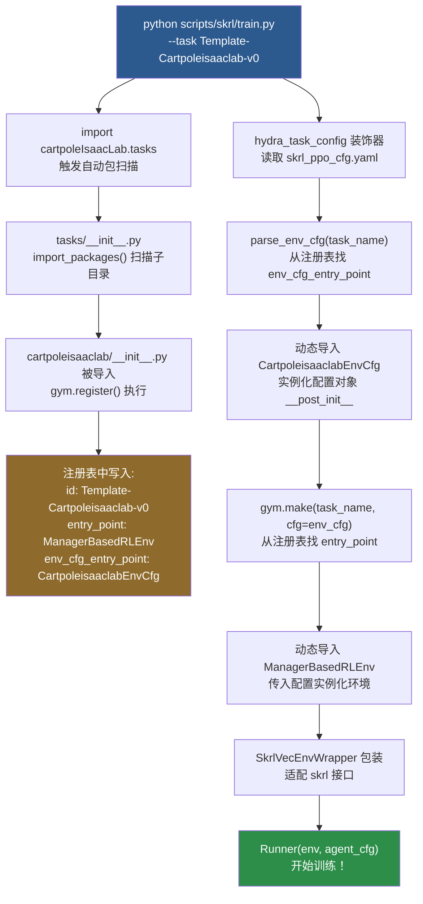

# 01 · IsaacLab 整体架构总览

> **目标**：理解 IsaacLab 是什么、它的设计哲学是什么、各层次怎么协作。

---

## 1. IsaacLab 是什么？

IsaacLab 是 NVIDIA 构建于 **Isaac Sim (Omniverse)** 之上的机器人强化学习框架。它的核心价值：

- 利用 GPU 并行运行 **数千个仿真环境**（本项目用 4096 个！）
- 用 **Manager-Based** 设计让你只需写配置，不用写环境逻辑
- 与 **gymnasium** 标准接口兼容，可以接入 skrl/RL_games/sb3 等任意 RL 库

---

## 2. 整体分层架构

```
┌──────────────────────────────────────────────────────────────────┐
│                      你的代码层（用户层）                          │
│   scripts/skrl/train.py   scripts/skrl/play.py                  │
└─────────────────────────────┬────────────────────────────────────┘
                               │ gym.make() / Runner()
┌─────────────────────────────▼────────────────────────────────────┐
│                      RL 库层（skrl）                              │
│   Runner → Trainer → PPO Agent → Policy/Value Network           │
└─────────────────────────────┬────────────────────────────────────┘
                               │ env.step() / env.reset()
┌─────────────────────────────▼────────────────────────────────────┐
│                   IsaacLab 环境包装层                             │
│   SkrlVecEnvWrapper → ManagerBasedRLEnv                         │
│   （适配 skrl 接口，处理向量化、设备映射等）                        │
└─────────────────────────────┬────────────────────────────────────┘
                               │ Manager 调用
┌─────────────────────────────▼────────────────────────────────────┐
│                   Manager 系统层（IsaacLab 核心）                  │
│   ObservationManager  RewardManager  TerminationManager          │
│   ActionManager       EventManager                               │
└─────────────────────────────┬────────────────────────────────────┘
                               │ 物理查询
┌─────────────────────────────▼────────────────────────────────────┐
│                   物理仿真层（Isaac Sim / PhysX）                  │
│   4096 个并行 CartPole 环境  GPU Tensor 计算                      │
└──────────────────────────────────────────────────────────────────┘
```

---

## 3. 环境注册与创建：工厂模式全流程

这是 IsaacLab 最关键的机制，理解它才能看懂代码是怎么"拼起来"的。



---

## 4. gym 注册表：关键代码

```python
# 文件: tasks/manager_based/cartpoleisaaclab/__init__.py
gym.register(
    id="Template-Cartpoleisaaclab-v0",
    
    # gym.make() 时动态导入这个类来创建环境
    entry_point="isaaclab.envs:ManagerBasedRLEnv",
    
    disable_env_checker=True,
    kwargs={
        # parse_env_cfg() 时动态导入这个类来创建配置
        "env_cfg_entry_point": f"{__name__}.cartpoleisaaclab_env_cfg:CartpoleisaaclabEnvCfg",
        
        # 训练脚本读取 YAML 超参数的入口
        "skrl_cfg_entry_point": f"{agents.__name__}:skrl_ppo_cfg.yaml",
    },
)
```

**两个入口点的作用：**

| 入口点 | 什么时候用 | 产生什么 |
|--------|-----------|---------|
| `entry_point` | `gym.make()` 时 | 环境实例 (ManagerBasedRLEnv) |
| `env_cfg_entry_point` | `parse_env_cfg()` 时 | 配置对象 (CartpoleisaaclabEnvCfg) |

---

## 5. 配置继承体系

IsaacLab 用 `@configclass`（类似 dataclass）来管理配置，核心是**继承+后处理**：

```
ManagerBasedRLEnvCfg           ← IsaacLab 基类，定义所有通用字段
        ↑
CartpoleisaaclabEnvCfg         ← 你的任务配置，覆盖特定字段
    ├── scene: CartpoleisaaclabSceneCfg   (场景：机器人+地面+灯光)
    ├── observations: ObservationsCfg     (观测：关节位置+速度)
    ├── actions: ActionsCfg               (动作：关节力矩)
    ├── events: EventCfg                  (事件：初始化时随机扰动)
    ├── rewards: RewardsCfg               (奖励：5项奖励函数)
    └── terminations: TerminationsCfg     (终止：超时/越界)
```

`__post_init__` 在所有字段初始化后执行，用来设置**相互依赖**的字段：
```python
def __post_init__(self) -> None:
    self.decimation = 2            # 2个物理步 = 1个控制步
    self.episode_length_s = 5      # 每回合最长5秒
    self.sim.dt = 1 / 120          # 物理时间步长
    self.sim.render_interval = self.decimation  # 依赖 decimation，所以在 post_init 里
```

---

## 6. Manager 系统：只写配置，不写逻辑

IsaacLab 的精华在于 **Manager 系统**，你不用写 `step()` 函数里的逻辑，只用在配置里**声明**：

```
用户配置（声明式）                  IsaacLab 自动执行（命令式）
─────────────────────────────────────────────────────
ObservationsCfg                 →  ObservationManager.compute()
  PolicyCfg:                          对每个 ObsTerm 调用 func(env)
    joint_pos_rel: ObsTerm(func=...)   自动注入 env 参数
    joint_vel_rel: ObsTerm(func=...)   拼接成 tensor 返回

RewardsCfg                      →  RewardManager.compute()
  alive: RewTerm(weight=1.0)          对每个 RewTerm 调用 func(env)
  pole_pos: RewTerm(weight=-1.0)      乘以 weight 后求和
  
TerminationsCfg                 →  TerminationManager.compute()
  time_out: DoneTerm(...)             返回 terminated/truncated mask

ActionsCfg                      →  ActionManager.process()
  joint_effort: JointEffortActionCfg  把 NN 输出的 action 缩放后
                 (scale=100.0)         施加到物理关节上
```

---

## 7. 并行环境：GPU Tensor 的魔力

CartPole 同时运行 4096 个环境，所有计算都在 GPU 上：

```
每个 env.step(actions) 调用：

actions: torch.Tensor [4096, 1]    ← 4096个环境的动作，同时处理
    ↓
物理引擎（PhysX GPU）并行步进
    ↓
observations: [4096, 4]            ← 4096个观测
rewards: [4096, 1]                 ← 4096个奖励（已对不同终止状态做好处理）
terminated: [4096, 1]              ← 哪些环境结束了
truncated: [4096, 1]               ← 哪些环境超时了
```

这就是为什么训练这么快——4096 个环境产生的数据，一个 batch 就处理完了。

---

## 8. 关键参数：时间步长说明

```
物理时间步长 sim.dt = 1/120 秒 ≈ 8.33ms
                    ↑
        PhysX 每步执行一次物理计算
        
decimation = 2
                    ↑
        每 2 个物理步 = 1 个控制步（env.step() 被调用一次）

控制时间步长 step_dt = sim.dt × decimation = 1/60 秒 ≈ 16.67ms

episode_length_s = 5 秒
最大步数 = 5 / (1/60) = 300 步
```

---

*← 返回 [目录](./index.md)　　→ 下一篇：[02_skrl程序架构](./02_skrl程序架构.md)*
