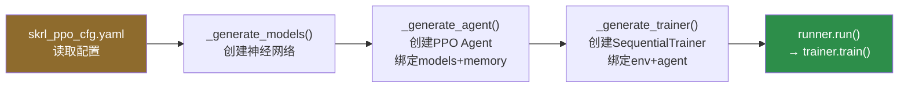
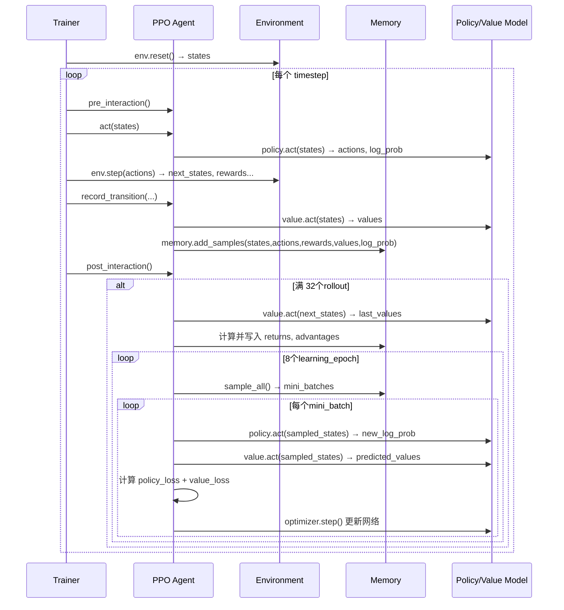

# 02 · skrl 程序架构

> **目标**：理解 skrl 库的核心设计，弄清楚 Runner/Trainer/Agent/Model/Memory 各自是什么、怎么关联。

---

## 1. skrl 是什么？

skrl（Simplified Keras RL）是一个为 GPU 并行环境设计的 PyTorch RL 库。它的核心特点：
- **模块化**：Model、Memory、Agent、Trainer 分离，可以自由替换
- **配置驱动**：通过 YAML 文件配置所有超参数
- **Runner 一键装配**：不需要手动 new 每个组件

---

## 2. skrl 核心组件全景图

```
┌──────────────────────────────────────────────────────────────────┐
│                         Runner                                    │
│  ┌─────────────────────────────────────────────────────────┐    │
│  │  读取 skrl_ppo_cfg.yaml，一键创建以下三个组件：           │    │
│  └─────────────────────────────────────────────────────────┘    │
│                                                                    │
│   ┌──────────────┐    ┌──────────────┐    ┌──────────────────┐   │
│   │   Models     │    │    Memory    │    │    Trainer       │   │
│   │              │    │              │    │                  │   │
│   │  Policy      │    │ RandomMemory │    │ Sequential       │   │
│   │  (Gaussian   │    │              │    │ Trainer          │   │
│   │   + Shared)  │    │ 存储轨迹数据  │    │                  │   │
│   │              │    │ states       │    │ 调用主训练循环    │   │
│   │  Value       │    │ actions      │    │                  │   │
│   │  (Deterministic│  │ rewards      │    │ single_agent     │   │
│   │   + Shared)  │    │ log_prob     │    │ _train()         │   │
│   └──────┬───────┘    │ values       │    └───────┬──────────┘   │
│          │            │ advantages   │            │               │
│          │            └──────┬───────┘            │               │
│          │                   │                    │               │
│          └────────┬──────────┘                    │               │
│                   ↓                               │               │
│   ┌───────────────────────────────┐              │               │
│   │            PPO Agent          │◄─────────────┘               │
│   │                               │                               │
│   │  act()  record_transition()   │                               │
│   │  post_interaction() _update() │                               │
│   └───────────────────────────────┘                               │
└──────────────────────────────────────────────────────────────────┘
```

---

## 3. Runner：组装一切的入口

`Runner` 是 skrl 的"导演"，它读取 YAML 配置，按顺序创建 Models → Agent → Trainer：

```python
# train.py 中只需要这两行
runner = Runner(env, agent_cfg)   # agent_cfg 来自 skrl_ppo_cfg.yaml
runner.run()
```

Runner 内部流程：



---

## 4. 模型（Models）：共享网络设计

### 4.1 YAML 中的配置

```yaml
models:
  separate: False          # False = 共享网络！Policy和Value共享特征层
  policy:
    class: GaussianMixin   # 策略网络：输出动作分布的均值
    network:
      - name: net
        input: OBSERVATIONS    # 输入：4维观测
        layers: [32, 32]       # 两个32维隐藏层
        activations: elu
    output: ACTIONS            # 输出：1维动作均值
  value:
    class: DeterministicMixin  # 价值网络：输出单个值
    network:
      - name: net
        input: OBSERVATIONS
        layers: [32, 32]
        activations: elu
    output: ONE                # 输出：1维状态值
```

### 4.2 SharedModel 网络结构图

`separate: False` 时，skrl 通过代码生成技术动态创建 SharedModel：

```
输入
 │
 │  observations [4096, 4]
 │  (cart_pos, cart_vel, pole_angle, pole_vel)
 │
 ▼
┌─────────────────────────────────────────────┐
│              共享特征提取层 (net_container)   │
│                                             │
│   Linear(4 → 32)  →  ELU                   │
│   Linear(32 → 32) →  ELU                   │
│                                             │
│   输出：32维特征向量 [4096, 32]              │
└──────────────────┬──────────────────────────┘
                   │ 共享的32维特征
          ┌────────┴────────┐
          ↓                 ↓
┌─────────────────┐  ┌──────────────────┐
│   策略头        │  │   价值头          │
│ (policy_layer)  │  │ (value_layer)    │
│ Linear(32 → 1)  │  │ Linear(32 → 1)  │
└────────┬────────┘  └────────┬─────────┘
         │                    │
         ↓                    ↓
   动作均值 μ [4096,1]   状态值 V(s) [4096,1]
   + 可训练 log_std 参数
         │
         ↓
   Normal(μ, exp(log_std))
   采样得到实际动作
```

**关键洞察**：`policy` 和 `value` 是**同一个对象**（Python 同一引用），共享所有特征层参数。这减少了参数量，也让两个目标协同优化。

```python
# 验证共享
print(self.policy is self.value)  # False（不同实例）
print(self.policy.net_container is self.value.net_container)  # True（同一网络！）
```

### 4.3 Mixin 设计模式

skrl 使用 Mixin 模式分离"行为"和"结构"：

```
Model（基类）           提供 num_observations, num_actions 等属性
    +
GaussianMixin           提供 act()：从正态分布采样动作，计算 log_prob
    +
DeterministicMixin      提供 act()：直接输出确定性值（用于价值函数）
    =
SharedModel             动态生成，同时继承两个 Mixin
```

---

## 5. Memory（经验回放缓冲）

PPO 使用 `RandomMemory`，它存储 `rollouts × num_envs` 步的轨迹数据：

```
Memory 存储结构（rollouts=32, num_envs=4096）：

┌──────────────────────────────────────┐
│  states      [32, 4096, 4]           │  ← 观测
│  actions     [32, 4096, 1]           │  ← 动作  
│  rewards     [32, 4096, 1]           │  ← 奖励
│  terminated  [32, 4096, 1]           │  ← 是否终止
│  truncated   [32, 4096, 1]           │  ← 是否截断
│  log_prob    [32, 4096, 1]           │  ← 动作概率对数
│  values      [32, 4096, 1]           │  ← 价值估计
│                                      │
│  (训练时计算并写入)                    │
│  returns     [32, 4096, 1]           │  ← GAE回报
│  advantages  [32, 4096, 1]           │  ← 优势函数
└──────────────────────────────────────┘

总样本量：32 × 4096 = 131,072 个样本/次更新
```

---

## 6. Trainer：训练主循环的骨架

`SequentialTrainer` 继承自 `Trainer`（base.py），核心是 `single_agent_train()`：

```python
# 伪代码（来自 base.py）
def single_agent_train(self):
    states, infos = env.reset()                    # 初始化
    
    for timestep in range(timesteps):
        # 1. 前处理钩子（PPO中为空）
        agent.pre_interaction(timestep, timesteps)
        
        # 2. 推理：获取动作
        actions = agent.act(states, timestep, timesteps)[0]
        
        # 3. 环境步进
        next_states, rewards, terminated, truncated, infos = env.step(actions)
        
        # 4. 记录转换数据（写入 Memory）
        agent.record_transition(states, actions, rewards, 
                                next_states, terminated, truncated, ...)
        
        # 5. 后处理（每 rollouts 步触发 PPO 更新）
        agent.post_interaction(timestep, timesteps)
        
        states = next_states
```

---

## 7. PPO Agent：决策与学习中心

PPO Agent 是最复杂的组件，它有 4 个核心方法：

```
┌─────────────────────────────────────────────────────┐
│                    PPO Agent                        │
│                                                     │
│  act(states)                                        │
│    → policy.act() 采样动作                          │
│    → 记录 log_prob 备用                              │
│                                                     │
│  record_transition(...)                             │
│    → value.act() 计算状态值                          │
│    → memory.add_samples() 写入缓冲                   │
│                                                     │
│  post_interaction()                                 │
│    → 检查是否满 rollouts 步                          │
│    → 是：调用 _update()                             │
│                                                     │
│  _update()   ← 这是 PPO 的心脏！                    │
│    → 计算 GAE 优势                                   │
│    → mini-batch 梯度下降                            │
│    → 更新 policy 和 value 网络                       │
└─────────────────────────────────────────────────────┘
```

---

## 8. 整体 skrl 组件交互图



---

## 9. 关键参数速查

| 参数 | 值 | 含义 |
|------|-----|------|
| `rollouts` | 32 | 收集多少步数据再更新一次 |
| `learning_epochs` | 8 | 每次更新时遍历数据几遍 |
| `mini_batches` | 8 | 每遍把数据分成几份 |
| 单次更新样本量 | 32×4096=131072 | 每次 update 用的总样本 |
| mini_batch 大小 | 131072/8=16384 | 每个小批次的样本数 |
| 总更新次数/timestep | 8×8=64次反向传播 | 每次 rollout 完成后 |

---

*← 上一篇：[01_IsaacLab架构总览](./01_IsaacLab架构总览.md)　　→ 下一篇：[03_Train数据流全景](./03_Train数据流全景.md)*
