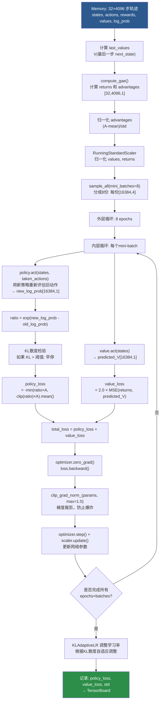

# 04 · PPO 算法详解

> **目标**：从数学原理到代码实现，彻底理解 PPO 的每一行代码在做什么。

---

## 1. PPO 是什么？（一句话）

PPO（Proximal Policy Optimization）= 在**不让策略变化太大**的前提下，尽量多地利用收集到的数据进行梯度更新。

---

## 2. PPO 核心循环图

```
┌─────────────────────────────────────────────────────────────────┐
│                        PPO 大循环                                │
│                                                                  │
│   ┌──────────────────────┐         ┌───────────────────────┐   │
│   │   数据收集阶段         │         │     网络更新阶段        │   │
│   │  (32 timesteps)      │────────▶│   (8 epochs × 8 mb)  │   │
│   │                      │         │                       │   │
│   │  act(s) → a, logπ    │         │  for each mini-batch: │   │
│   │  env.step(a) → s',r  │         │    新 logπ' = π(a|s)  │   │
│   │  V(s) 价值估计        │         │    ratio = π'/π       │   │
│   │  写入 Memory          │         │    clip(ratio, ε)     │   │
│   └──────────────────────┘         │    loss.backward()    │   │
│              ↑                     │    optimizer.step()   │   │
│              └─────────────────────└───────────────────────┘   │
│                    清空 Memory，重新收集                         │
└─────────────────────────────────────────────────────────────────┘
```

---

## 3. 三大核心技术详解

### 3.1 GAE（广义优势估计）

**为什么需要优势函数？**
- 奖励信号很嘈杂，直接用 r 作为更新信号方差很大
- 用 A(s,a) = Q(s,a) - V(s) 量化"这个动作比平均好多少"

**GAE 公式：**
```
δ_t = r_t + γ·V(s_{t+1})·(1-done_t) - V(s_t)    ← TD误差

A_t^GAE = δ_t + (γλ)·δ_{t+1} + (γλ)²·δ_{t+2} + ...

        = Σ_{k=0}^{∞} (γλ)^k · δ_{t+k}
```

**代码实现（来自 ppo.py）：**
```python
def compute_gae(rewards, dones, values, next_values, γ=0.99, λ=0.95):
    advantage = 0
    advantages = torch.zeros_like(rewards)
    not_dones = dones.logical_not()
    
    # 从后往前递推（更高效）
    for i in reversed(range(memory_size)):
        next_V = values[i+1] if i < memory_size-1 else last_values
        advantage = (
            rewards[i]
            - values[i]
            + γ * not_dones[i] * (next_V + λ * advantage)
        )
        advantages[i] = advantage
    
    returns = advantages + values      # R_t = A_t + V(s_t)
    advantages = (advantages - advantages.mean()) / (advantages.std() + 1e-8)
    return returns, advantages
```

**参数影响：**
```
λ=0：纯 TD（一步估计）→ 低方差，高偏差
λ=1：纯 MC（全轨迹）→ 高方差，低偏差
λ=0.95（本项目）：平衡点，实践中最常用
```

---

### 3.2 Clipped Surrogate Objective（策略损失）

**核心思想：** 让新策略不要偏离旧策略太远

```
ratio = π_new(a|s) / π_old(a|s) = exp(log π_new - log π_old)

L_CLIP = E[ min(
    ratio × A,                          ← 普通策略梯度
    clip(ratio, 1-ε, 1+ε) × A          ← 截断后的版本
)]
```

**图示（ε=0.2）：**

```
A > 0（好动作）:                    A < 0（坏动作）:

loss                                loss
 │     ___________                   │
 │    /                              │    ↑ 鼓励减小概率
 │   /                               │   /
 │  /                                │  /___________
 │ /                                 │ /
─┼──────────────── ratio          ─┼──────────────── ratio
 0   0.8    1.2                      0   0.8    1.2
      ↑      ↑                              ↑      ↑
    1-ε    1+ε                            1-ε    1+ε

比值>1.2时：不再鼓励增大（防止步子太大）
比值<0.8时：不再惩罚减小（防止崩溃）
```

**代码实现：**
```python
ratio = torch.exp(new_log_prob - old_log_prob)    # π_new / π_old

surrogate = advantages * ratio
surrogate_clipped = advantages * torch.clip(ratio, 1.0 - 0.2, 1.0 + 0.2)

policy_loss = -torch.min(surrogate, surrogate_clipped).mean()
#              ↑ 取 min 保证保守更新
#             负号因为我们要最大化，而 optimizer 做最小化
```

---

### 3.3 Value Loss（价值函数损失）

价值网络需要学会预测实际回报：

```
V_loss = MSE(V_predicted(s), R_GAE)

本项目中: value_loss_scale = 2.0
total_loss = policy_loss + 2.0 × value_loss
```

可选的 Value Clipping（本项目开启）：
```python
if clip_predicted_values:
    predicted_values = old_values + clip(
        predicted_values - old_values, 
        -value_clip,    # -0.2
        +value_clip     # +0.2
    )
value_loss = 2.0 × MSE(returns, predicted_values)
```

---

## 4. 完整更新流程图



---

## 5. KL 自适应学习率

本项目使用 `KLAdaptiveLR` 而不是固定学习率：

```python
# 来自 skrl_ppo_cfg.yaml
learning_rate_scheduler: KLAdaptiveLR
learning_rate_scheduler_kwargs:
  kl_threshold: 0.008
```

工作原理：
```
KL散度 = E[π_new/π_old - 1 - log(π_new/π_old)]

如果 KL_mean > 2 × kl_threshold (0.016):
    学习率 /= 1.5    ← 策略变化太大，降速
    
如果 KL_mean < 0.5 × kl_threshold (0.004):
    学习率 *= 1.5    ← 策略变化太小，加速
```

---

## 6. RunningStandardScaler 预处理器

本项目对观测和价值都使用了归一化：

```python
# state_preprocessor 对观测做归一化
# value_preprocessor 对价值做归一化

class RunningStandardScaler:
    """在线计算均值和标准差，适用于非静止数据"""
    
    def forward(self, x, train=False, inverse=False):
        if inverse:
            return x * std + mean        # 逆变换（得到真实价值）
        
        if train:
            # 更新在线统计量（Welford 算法）
            self.running_mean = ...
            self.running_variance = ...
        
        return (x - mean) / (std + 1e-8)  # 标准化
```

**为什么要归一化价值？**
- 奖励范围可能变化很大
- 归一化后 MSE Loss 的数值更稳定
- 但是计算优势函数时需要逆变换回真实值

---

## 7. Mixed Precision（混合精度训练）

本项目默认关闭，但可以启用：

```python
# ppo.py 中的封装
with torch.autocast(device_type="cuda", enabled=mixed_precision):
    # FP16 计算（更快，更省内存）
    actions, log_prob, _ = policy.act(...)

self.scaler.scale(loss).backward()   # FP16 梯度缩放
self.scaler.step(optimizer)          # 反缩放后更新
self.scaler.update()
```

---

## 8. PPO 超参数影响速查

| 参数 | 值 | 如果增大 | 如果减小 |
|------|-----|---------|---------|
| `rollouts` | 32 | 更多数据/次更新，更稳定 | 更频繁更新，更快但不稳 |
| `learning_epochs` | 8 | 充分利用数据 | 减少过拟合风险 |
| `mini_batches` | 8 | 更小batch，噪声更多 | 更大batch，更稳定 |
| `discount_factor γ` | 0.99 | 更长远规划 | 更短视，更稳定 |
| `lambda λ` | 0.95 | 减少偏差 | 减少方差 |
| `ratio_clip ε` | 0.2 | 允许更大策略变化 | 更保守更新 |
| `grad_norm_clip` | 1.0 | 允许更大梯度 | 防止梯度爆炸 |
| `learning_rate` | 5e-4 | 更新更快但不稳 | 更稳定但慢 |

---

## 9. 常见问题排查

### Q: 训练不收敛
- 检查 `rewards_shaper_scale`（本项目0.1），太大会数值不稳定
- 检查 `learning_rate`，可能需要调小
- 观察 `policy_loss`，应该在一定范围内震荡下降

### Q: 训练太慢
- 增大 `num_envs`（更多并行环境）
- 减小 `rollouts`（更频繁更新）
- 检查 GPU 利用率

### Q: reward 震荡严重
- 减小 `learning_rate` 或用 `KLAdaptiveLR`
- 增大 `learning_epochs` 充分利用每批数据
- 检查奖励函数设计是否合理

---

*← 上一篇：[03_Train数据流全景](./03_Train数据流全景.md)　　→ 下一篇：[05_环境配置系统](./05_环境配置系统.md)*
